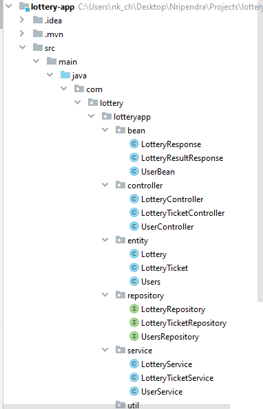
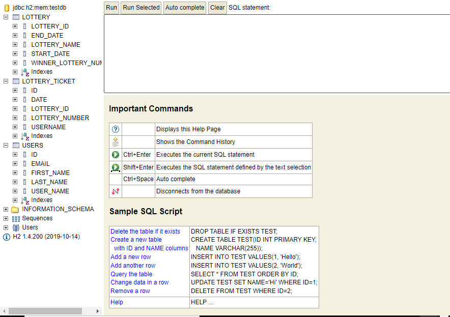
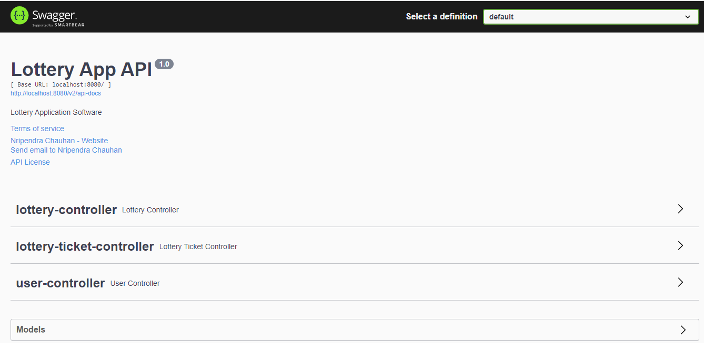

# Lottery Application

Application creates a lottery that will end at midnight each day.App allows participants to purchase tickets for active lottery.
Once the Lottery closes a random winner is extracted from the pool and save winner number in a storage db.

Requirements:
- The service will allow anyone to register as a lottery participant.
- Lottery participants will be able to submit as many lottery ballots for any lottery that isn’t yet finished.
- Each day at midnight the lottery event will be considered closed and a random lottery winner will be selected from all participants for the day.
- All users will be able to check the winning ballot for any specific date.
- The service will have to persist the data regarding the lottery.

In Addition:
- An unregistered user cannot purchase lottery tickets.
- The lottery can always be started with the lottery name. The only rule is that multiple active lotteries cannot be created with the same lottery name.
- The lottery ticket number has a unique sequential generated number per lottery starting at 1.

## 1 - How to Run Project

 *BUILD it:*

unzip and navigate with your command line to the lottery folder
- > mvn clean install

Will run tests (unit and integration),
Will install the lottery snapshot jar to the .m2 repository folder

*RUN it:*

In your command line:
> java -jar target/lottery-app-0.0.1-SNAPSHOT.jar

or using Spring Boot Maven plugin
> mvn spring-boot:run

Follow instructions on console..

Or simply import project to your preferred idea (Eclipse or Intellij) and run it from there.

#### Prerequisites

- Have installed and configured **Maven** and **JAVA11**
- PORT **8080** is free
- Can run Spring Boot application.
- Preferred IDE
    - IntelliJ IDEA
    - VS Code
    - Eclipse

Database tables are created on application load in inmemory db(h2). Open below url in browser:
- http://localhost:8080/h2-ui

Change **application.properties** as :

```sh
spring.application.name=lottery-app

spring.datasource.url=jdbc:h2:mem:testdb
spring.datasource.driverClassName=org.h2.Driver
spring.datasource.username=sa
spring.datasource.password=

spring.jpa.show-sql=true
spring.jpa.properties.hibernate.dialect=org.hibernate.dialect.H2Dialect
spring.jpa.hibernate.ddl-auto= update

spring.h2.console.enabled=true
# default path: h2-console
spring.h2.console.path=/h2-ui
server.error.include-message= always
spring.main.allow-circular-references=true
spring.mvc.pathmatch.matching-strategy=ant-path-matcher

 ```

## 2 - Tools and Technologies Used

* ```Spring Boot```- 2.6.2.RELEASE
* ```JDK``` - 1.8 or later
* ```Spring Data``` JPA
* ```Maven``` - 3.2+
* ```IDE``` - IntelliJ IDEA
* ```Postman```
* ```Swagger``` - 3.0.0


## 3 - Packaging Structure
Following is the packing structure of our Lottery App:


## 4 - Database Design

Prefered standard SQL database. I prefer Mysql but for the simplicity and run application locally I used h2(in memory db). In order to use Mysql please change the database URL and username/password accordingly in application.properties file.
Db snapshot: 


There are 3 tables for the lottery design. 
- **lottery:** Holds the lottery information for the current lottery 
- **lottery_ticket:**  Holds the ticket information for the lotteries.
- **users:** Holds user details. 
Here is how the design looks:

**lottery**

- lottery_id
- lottery_name
- start_date
- end_date
- winner_lottery_number


**lottery_ticket**
- id
- lottery_id
- username
- lottery_number (Ticket number in the current lottery. It contains sequential numbers per lottery.)
- date

**users**

- id
- user_name
- first_name
- last_name
- email

### 4 - Swagger URL:

  - Swagger UI: http://localhost:8080/swagger-ui/index.html


## 7 - Could have done

- [ ] I could have give functionality to purchase multiple tickets at a time.
